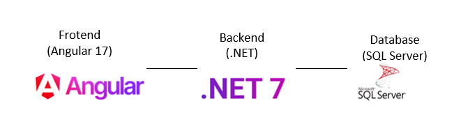

# Sistema de Reservas

## Descripción

Este proyecto es un sistema de reservas que permite a los usuarios gestionar reservas para servicios como restaurantes u hoteles. Los usuarios pueden crear, modificar, cancelar y visualizar reservas, con opciones para filtrar por fecha, servicio y cliente. El sistema está construido utilizando un frontend en Angular 17, un backend en ASP.NET Core y una base de datos SQL Server.

## Diagrama de Arquitectura



```plaintext
+-----------------+        +--------------------+        +-----------------+
|                 |        |                    |        |                 |
|   Frontend      +-------->   Backend API      +-------->    Database     |
|   (Angular 17)  |        |   (ASP.NET Core)   |        |   (SQL Server)  |
|                 |        |                    |        |                 |
+-----------------+        +--------------------+        +-----------------+

## Configuración y Ejecución de la Aplicación

### Requisitos Previos

- Node.js y npm
- .NET 7.0
- SQL Server

### Configuración del Backend

1. Clonar el repositorio:
    ```sh
    git clone https://github.com/carsepe/ReservasAPI.git
    cd ReservasAPI
    ```

2. Restaurar las dependencias de NuGet:
    ```sh
    dotnet restore
    ```

3. Actualizar la cadena de conexión a tu base de datos en `appsettings.json`:
    ```json
    "ConnectionStrings": {
      "DefaultConnection": "Server=tu-servidor;Database=SistemaReservasDB;User Id=tu-usuario;Password=tu-contraseña;"
    }
    ```

4. Aplicar las migraciones para configurar la base de datos:
    ```sh
    dotnet ef database update
    ```

5. Ejecutar el proyecto:
    ```sh
    dotnet run
    ```

### Configuración del Frontend

1. Navegar al directorio del frontend:
    ```sh
    cd reservas-frontend
    ```

2. Instalar las dependencias:
    ```sh
    npm install
    ```

3. Ejecutar la aplicación Angular:
    ```sh
    ng serve
    ```

4. Abrir el proyecto desde [http://localhost:4200](http://localhost:4200)

## Funcionalidades

- **Crear Reserva**: Permite a los usuarios crear una nueva reserva.
- **Modificar Reserva**: Permite a los usuarios editar los detalles de una reserva existente.
- **Cancelar Reserva**: Permite a los usuarios eliminar una reserva.
- **Visualizar Reservas**: Permite a los usuarios ver todas las reservas con opciones de filtrado por fecha, servicio y cliente.

## Documentación de la API

La documentación de la API se puede generar utilizando Swagger. Para acceder a la documentación, ejecutar el backend y navegar a [https://localhost:7294/swagger/index.html](https://localhost:7294/swagger/index.html)

## Autor

Carlos Segura - carlos.segurap09@gmail.com

